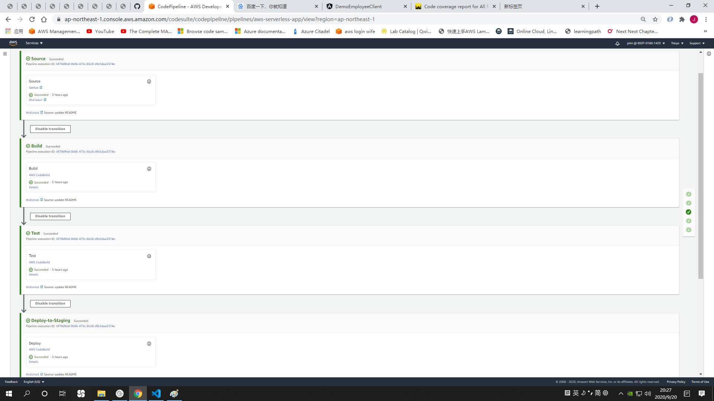

# Demo code for employee server

## Application code
application code is in src/employees folder, it's a AWS lambda function that it will handle employees CRUD functions.

## Pipeline code
pipeline is defined by AWS CDK, it's in pipeline folder.

For CI/CD it assumes there are two environments: staging and production.

## Architecture

Application is responsible for CRUD employee information. It stores data in DynamoDB table through Lambda functions.

## Pipeline


## Requirements

* Node.js 12 or above
* npm 6 or above
* [AWS SAM CLI 0.40.0](https://docs.aws.amazon.com/serverless-application-model/latest/developerguide/serverless-sam-cli-install.html). It requires you to set AWS credentials so that it can make calls to AWS services on your behalf.
* Set the AWS region you want to deploy this application to. You can do so through `aws configure` or `AWS_DEFAULT_REGION` environment variable.

## Project Structure

AWS SAM template is defined in the root directory through a YAML file. It defines:

* An input `Parameter` that specifies to which environment we are going to be deploying to
* A `Condition` that based on the parameter above determines if this is a deployment to production or not. This is needed as different resources and configurations will be used based on the environment.
* `Global` section to define those parameters that are common to multiple resources in the template.
* Lambda function called `EmployeeFunction` which is responsible for CRUD employee data with DynamoDB table. This component is the core of the application and hence, it is formed by the following configuration:
  * IAM Policies so it can read / write data into DynamoDB table.
  * For staging, new versions are deployed to an alias named after the environment with a bluen/green approach.
  * For production, we use a more conservative approach that allows us to gradually shift traffic towards the new version. During the time this deployment lasts, a CloudWatch alarm (`AliasErrorMetricGreaterThanZeroAlarm`) is monitored so in case it throws errors, a rollback to the previous version is performed.
  * Lastly, deployments to both environments perform a check (or smoke test) for the new version before shifting traffic to it through a lambda function (`PreTrafficCheckFunction`). If it fails, traffic is not routed to the new version and deployment is considered failed.
* Aforementioned DynamoDB table: `employees`.

## Using SAM to deploy the app

Packaging and deploying the app to AWS is relatively straight forward since all configuration is defined in `template.yml`.

* Package your lambda functions and store them safely in a S3 bucket. This command outputs the corresponding version of your `template.yml` pointing to where your artifacts have been stored in S3.
  
  ```sh
  sam package --s3-bucket my-artifacts-bucket --s3-prefix my-prefix --output-template-file out.yml
  sam package --s3-bucket john-tool-tokyo --s3-prefix employee-server-deploy --output-template-file out.yml
  ```

* Deploy a new version of your app using the artifacts the command above just generated (using staging as the target environment for demo purposes):

  ```sh
  sam deploy --template-file out.yml --stack-name my-stack-staging --parameter-overrides ParameterKey=Environment,ParameterValue=staging --capabilities CAPABILITY_IAM
  ```

  You can monitor how the deployment is happening through AWS CodeDeploy as the above will create a new application in this service alongside a deployment group for your lambda.

These two commands will be usesd in both `Build` and `Deploy` steps of our pipeline.

## Testing your lambda locally

Create a docker network and run a local dynamodb container in it:

```sh
docker network create my-network
docker run -d --network my-network -v "$PWD":/dynamodb_local_db -p 8000:8000 \
    --network-alias=dynamodb --name dynamodb \
    amazon/dynamodb-local -jar DynamoDBLocal.jar -sharedDb
```

Create the following table in the local DynamoDB:

```sh
aws dynamodb create-table --table-name employees \
    --attribute-definitions AttributeName=email,AttributeType=S \
    --key-schema AttributeName=email,KeyType=HASH \
    --endpoint-url http://localhost:8000 \
    --provisioned-throughput ReadCapacityUnits=5,WriteCapacityUnits=5
```

Check previous step ran successfully:

```sh
aws dynamodb list-tables --endpoint-url http://localhost:8000
aws dynamodb describe-table --table-name employees --endpoint-url http://localhost:8000
```

Finally, test your function with a dummy event (that can be generated with `sam local generate-event apigateway aws-proxy`):

```sh
TABLE=employees sam local invoke "EmployeeFunction" -e events/event.json  --docker-network my-network
```

Notice that our lambda function will point to the local DynamoDB container for the command above through its HTTP layer. Condition is based on `AWS_SAM_LOCAL` which automatically gets set by `sam` when executing `local` commands.

A very similar approach using Docker will be taken to perform end-to-end tests for our lambda function and its integration with DynamoDB.

## Monitoring

AWS SAM CLI allows to monitor any lambda function given its logical id within a stack or its name as we would visualize them using Cloudwatch. For ie:

```sh
sam logs -n EmployeeFunction --stack-name aws-serverless-app-staging --tail
```

## CI/CD

```sh
Source -> Build -> Test -> Deploy to Staging -> Deploy to Production (Manuall approval + Deploy)
```

Stages and actions are implemented using AWS CodePipeline, AWS CodeBuild and AWS CodeDeploy (behind the scenes through `sam deploy` command).

Pipeline itself is defined and provisioned by [AWS CDK](https://docs.aws.amazon.com/cdk/latest/guide/home.html) using Typescript.

To get it provisioned follow these steps:

* First, install AWS CDK tools:

  ```sh
  npm install -g aws-cdk
  ```

* Then, fetch dependencies and provision pipeline:

  ```sh
  cd pipeline
  npm i
  npm run build
  cdk deploy
  ```

  There will be a summary of security-related changes that needs to be approved to continue with the CloudFormation template creation.

NOTES:

* This step needs to be implemented only once when starting to work on this project.
* Artifacts generated by the pipeline are stored in an Amazon S3 bucket called `ci-cd-pipeline-artifacts`.
* Artifacts which are specific for our application are stored in an Amazon S3 bucket called `aws-serverless-app-artifacts`.
* Aforementioned buckets are created by our CDK script and hence, they cannot exist before running it.
* To successfully connect to Github:
  * Username is provided through a AWS SSM parameter called `github_username`,
  * Secret is provided through AWS Secrets Manager. Both secret name and field are called `githubToken`.


## License

This library is licensed under the MIT-0 License. See the LICENSE file.
